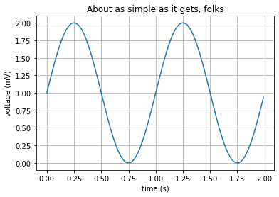

# This is SHOWCASE.ipynb


```python
import matplotlib.pyplot as plt
import numpy as np
%matplotlib inline
```

## Voltage Curve

some experiments.


```python
t = np.arange(0.0, 2.0, 0.01)
s = 1 + np.sin(2*np.pi*t)
plt.plot(t, s)

plt.xlabel('time (s)')
plt.ylabel('voltage (mV)')
plt.title('About as simple as it gets, folks')
plt.grid(True)
plt.show()

```


    

    

