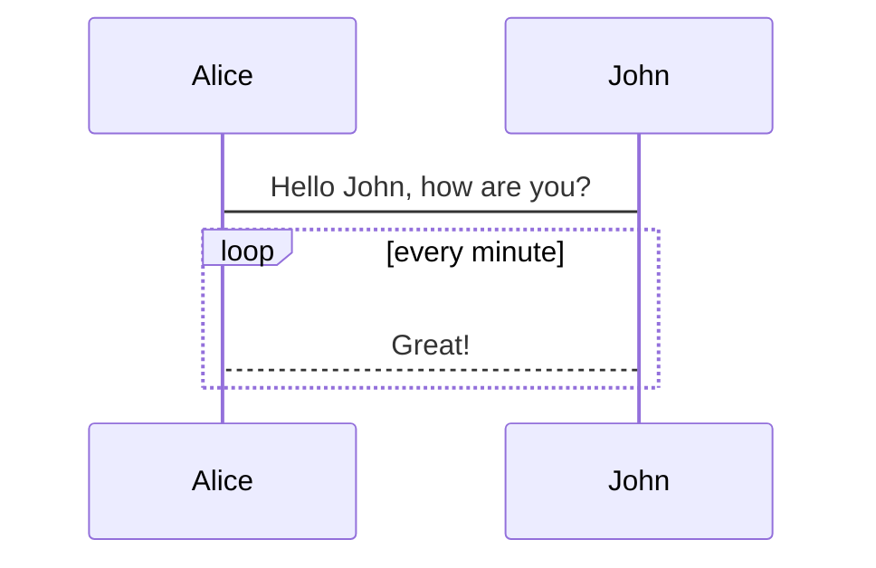

# Homepage

Set up you markdown files site in one minute, powered by [Docsify](https://docsify.js.org/).

Your :star: would be high praise for my efforts, thank you!

Demo is here: [Maxlinn's Docsify Template Demo](https://maxlinn.github.io/linn-docsify-template).

## Usage

- Use this repository as template.
  - You'll get a `main` branch with those files
    - `index.html`, settings, **must modify, at least modify those commented with `!!!`**.
    - `README.md`, homepage of your site, **change it to yours**.
    - `.nojekyll`, nevermind.
    - `_navbar.md, _sidebar.md, _footer.md`, **change it to yours**. Remove any if you don't like.
    - Folder `a-great-subfoloder`, just for demo, **remove it and its contents**.
    - `favicon.svg`, the icon your site, **change it to yours**. To use other format, edit `index.html`.
- Go to repository settings, set `github pages` work on `main` branch.
- Done!

## Reminder

- `README.md` of each folder level would serve as homepage of this level, like this one you are reading. 
  - So don't hesitate to change this `README.md` to create your own homepage!
- The sidebar serve as a document navigator as well as `table of contents` of current document.
  - The sidebar item starts with an `-` belongs to `table of contents` of current document.
  - Other sidebar items are defined in `_sidebar.md`.
- To disable features, comment its plugin `<script>` tag inside `index.html`.

## Features

Powered by [plugins of docsify](https://docsify.js.org/#/plugins), and [community contributions](https://docsify.js.org/#/awesome?id=awesome-docsify-).

- Full text search.
  - Discover documents by hyperlinks of the documents you viewed, like a web spider.
  - Implemented just in frontend.
  - **Not always index all documents of this site**.
  - Search index rebuilt every one day by default, stored in localstorage.
- Dark mode switch button.
- LaTeX, mermaid.js, code highlight support.
- Custom font settings.
- User experience enhancement.
  - Copy code button.
  - PanGu, add space when Chinese and English characters drawing near.
  - Collapsable nested sidebar.
- Support [tabs syntax](https://jhildenbiddle.github.io/docsify-tabs/#/?id=usage), see examples in syntax test below.

## Markdown Syntax Test

~~deleted~~

==hightlight==

$a^2+b^2=c^2$

$$
a^2+b^2=c^2
$$

:star:



```python
for i in range(42):
    print("calm down")
```

## Tab Syntax

- Bold of headings(`**`) is necessary to trigger the syntax!
- Though it uses headings, it won't affect headings of markdown.
- If two of more tabs contain tab of the same name, **once a tab is selected, all tabs of the same name will be selected**.
  - It is extremely useful to show codes of different languages.

```markdown
<!-- tabs:start -->
### **English**
Hello!
### **French**
Bonjour!
### **Italian**
Ciao!
<!-- tabs:end -->
```

<!-- tabs:start -->
### **English**
Hello!
### **French**
Bonjour!
### **Italian**
Ciao!
<!-- tabs:end -->

## Tab Syntax - Equivalent Usage

```markdown
<!-- tabs:start -->
<!-- tab:English -->
Hello!
<!-- tab:French -->
Bonjour!
<!-- tab:Italian -->
Ciao!
<!-- tabs:end -->
```

<!-- tabs:start -->
<!-- tab:English -->
Hello!
<!-- tab:French -->
Bonjour!
<!-- tab:Italian -->
Ciao!
<!-- tabs:end -->